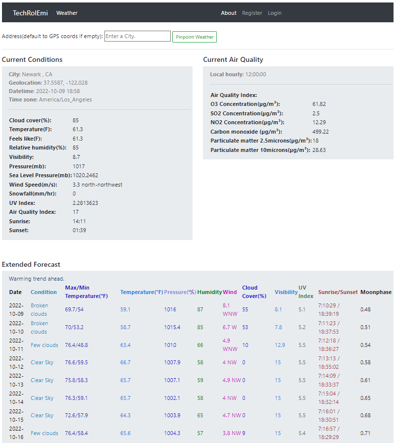
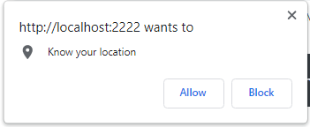
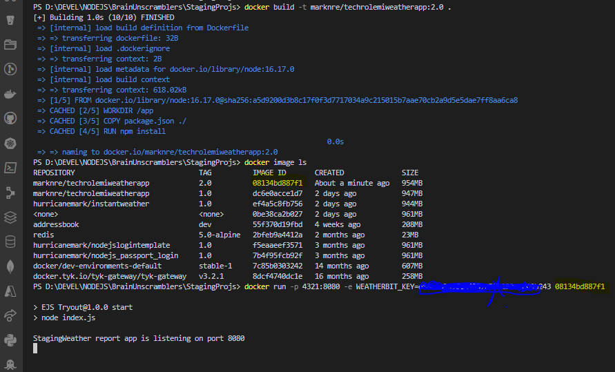
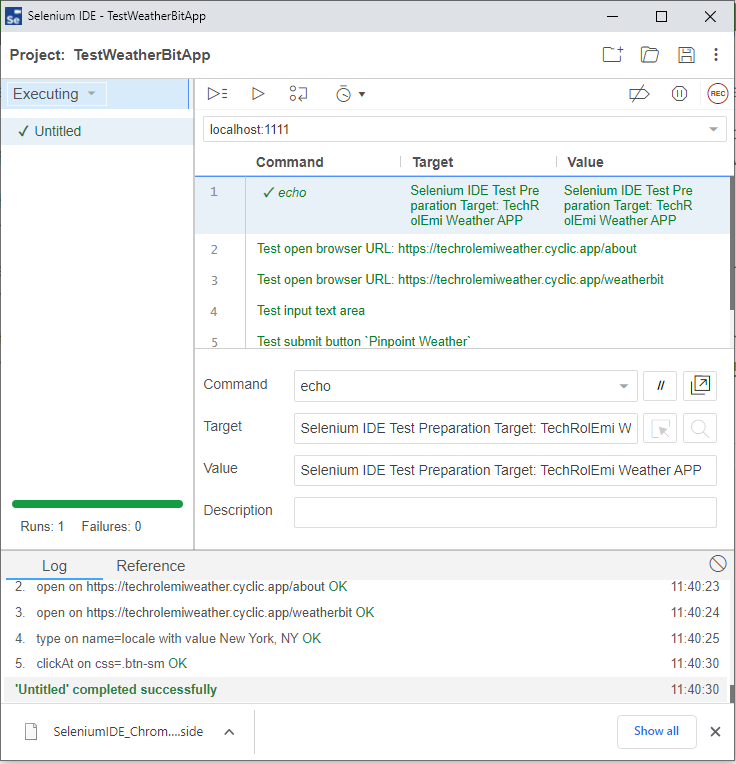
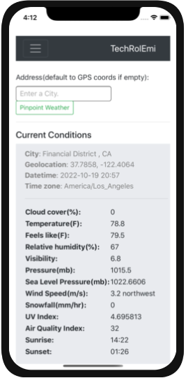

# A Responsive NodeJS-Express Web App With Stepwise Implementation

This project is intended for the beginner to novice javascript developers who are interested in the nuts and bolts of implementing a working web application using various frameworks and libaries.  Although this only scratches the surface of a real-life software development project, you will experience what it takes to bring an idea to fruition.

<br />

# Weather Service

Ever wonder why your phone shows weather data of your immediate vicinity on your travel?  This project demonstrates the use of Navigator.geolocation API that is part of NodeJS to pinpoint your immediate location.  The geolocation method gets the current position in longitude and latitude.  The weather app uses these values to call a weather service API for weather data.  This non-interactive process happens automatically for your convenience.

<strong>Sample output</strong>



---

## The Value of Weather Information 

Weather information is powerful knowledge used in forecasting the production of certain operations to help determine the economic bottom line.  There are countless human endeavors affected by weather factors.  Rain is good for growers, and forewarning is valuable in extreme weather, while the sunny sky and windy days could be good for energy production.  For example, solar power production needs to know the number of hours of sunlight specific to geographical location.  Wind farm needs to know wind speed, direction, etc. The travel and hospitality industry is most affected by dynamic weather patterns.  From agriculture to space-faring, weather plays a key role in the decision-making process.

There are weather detection stations situated in and around you.  The inner working of making data available is not of interest to the populous but it is vital to a functioning society.  Although, the National Weather Service is a government agency that disseminates data free of charge.  Weather data has been monetized by repackaging in ways the population can consume.  e.g. Local TV news reserve a segment devoted to weather ubiquitously.  Weather data is available at your fingertips.  It is all factored into a transferable cost by some service providers you're currently paying.  For weather application developers, the `effective cost per thousand impressions` (eCPM) metric is higher compared to educational apps.  You can effectively monetize your project if you do it right.

<br />

> Below is the template for a rudimentary completion of an example on interfacing with a weather data provider.  <br /><span style="color:green">For indepth logics and real life data implementation, continue to</span> [here](public/README.md).

<br />


## NodeJS and Express

I recently wrote this weather reporting app using the cloud editor `replit` where the bootstraping of node JS is hidden.  All I had to do was to focus on the core logic in app.js, style.css, and index.html.  To create a fully functional development environment locally, I needed to bootstrap NodeJS, Express to my replit code.  

Here is how I add scalffolding my Nodejs project.

**Configure Project Development Environment for ES6**

>Let's assume you are using NodeJS with a version later than 13.  Then, it is required to configure the development environment to work for ExpressJS with dotenv and ES6 modules.

First, you will need to change your `package.json` to include:

```c
...
"type": "module",
...
```

Then, use imports in your `index.js`.  Here is an express start with dotenv:

```c
import dotenv  from "dotenv"
import express from "express"

dotenv.config()

const app = express()
const port = process.env.PORT || 5000

app.get('/', (req, res) => {
  res.send("Local Weather.  Don't leave home without reading it")
})

app.listen(port, () => {
  console.log(`Local weather server is serving you from http://0.0.0.0:${port}`)
})
```

<br />

Step 1:  Migrate replit code to local VSCode.
    Create a folder for your project.  Create sub folders `views` and `public` to place client-side programming. 
    
    `mkdir views`

    `mkdir public`

Step 2:  Initialize the folder as a node project
    
    ` npm init -y`

Step 3:  Install *express* to configure a lightweight Node server
    
    `npm install express`

Step 4:  Install *helmet* to configure runtime security
    
    `nmp install helmet`

Now, you are good to start developing and running from VSCode.

### Project Layout

It is a typical NodeJS project layout.  

'index.js' - server file

'./public/script.js' - interface to https://weather-proxy.freecodecamp.rocks/api/

'./views/index.html' - client-side presentation. 

## Runtime

`npm start`

>Initially, the browser might pop up asking if you would allow it to detect your location.  An 'Allow' will enable GPS pinpoint weather report.  A 'Block' will disable GPS for current and subsequent sessions.



<br />


## Build Once, Run Anywhere!

<strong> Generate A Docker Image</strong>

If you pulled or cloned this code base, replace my dockerhub username 'marknre' with your own DockerHub's username.  
Using the correct DockerHub username ensures error free `docker push` operation.

Build a docker image base on the given Dockerfile and .dockerignore is this folder.  
After successful docker build, run the image to verify correctness.  
Then it can be pushed to dockerhub or your favorite cloud provider.  

`docker build -t marknre/techrolemiweatherapp:2.0 .`

```c
docker build -t marknre/techrolemiweatherapp:2.0 .      

[+] Building 3.1s (11/11) FINISHED
 => [internal] load build definition from Dockerfile                                                  0.0s 
 => => transferring dockerfile: 32B                                                                   0.0s 
 => [internal] load .dockerignore                                                                     0.0s 
 => => transferring context: 2B                                                                       0.0s 
 => [internal] load metadata for docker.io/library/node:16.17.0                                       1.1s 
 => [auth] library/node:pull token for registry-1.docker.io                                           0.0s 
 => [internal] load build context                                                                     0.4s
 => => transferring context: 635.22kB                                                                 0.3s
 => [1/5] FROM docker.io/library/node:16.17.0@sha256:a5d9200d3b8c17f0f3d7717034a9c215015b7aae70cb2a9  0.0s
 => CACHED [2/5] WORKDIR /app                                                                         0.0s
 => CACHED [3/5] COPY package.json ./                                                                 0.0s
 => CACHED [4/5] RUN npm install                                                                      0.0s
 => [5/5] COPY . .                                                                                    0.9s
 => exporting to image                                                                                0.7s
 => => exporting layers                                                                               0.6s
 => => writing image sha256:1c4db40ce8799665d8226aea4ae5759b3dc17c0538992b95e59b2e74375da1c7          0.0s
 => => naming to docker.io/marknre/techrolemiweatherapp:2.0                                           0.0s
 ```

**List the image**

```c
PS D:\DEVEL\NODEJS\BrainUnscramblers\StagingProjs> docker image ls
REPOSITORY                              TAG          IMAGE ID       CREATED              SIZE
marknre/techrolemiweatherapp            2.0          08134bd887f1   About a minute ago   954MB
marknre/techrolemiweatherapp            1.0          dc6e0acce1d7   2 days ago           947MB

```


**On the DockerHub registry**

A docker image built with this `git-tag`:`Phase1-Extened-Weather-Forecasts` is available to the public on the [DockerHub registry](https://hub.docker.com/r/marknre/techrolemiweatherapp).  You can pull it with the command below:

```docker pull marknre/techrolemiweatherapp:latest```


### Run docker

Notice that environment variables (secret keys) required to run the app is not being included in the Dockerfile.  These secret keys will be stated with the container.  
eg.  `... -e WEATHERBIT_KEY=XXXXXXX`

Notice also that Dockerfile exposes port 8080.  This needs to be forwarded to a port on your local machine.  i.e. `LOCAL_PORT:CONTAINER_PORT` for example  *4321:8080*

`docker run -p 4321:8080 --memory=128m -e  WEATHERBIT_KEY=Actual_Secret_Key_for_Weatherbit  bb89b0646be4`

<br />



<hr />

To access the Local Weather app running in docker container, point your browser to the forwarding port 4321.

`http:/localhost:4321`

<br />

## Hosting on A Public Site

For the purpose of hosting this app, we select [Cyclic free-for-life tier](https://app.cyclic.sh/api/login).
Cyclic deploys full stack NodeJS apps on AWS infrastructure directly from GitHub. It works by integrating with your GitHub repos. It will build and deploy your code on every merge or push to your default branch.

Please do not abuse this live website below.  Thank you!
[Live demo](https://techrolemiweather.cyclic.app/about)

**Recommend Cylic** https://app.cyclic.sh/#/join/hurricanemark

## Test Automation

[Selenium](https://www.selenium.dev/documentation/) is an opensource providing QA testing environment best fit for test automation.  Selenium supports multiple languages such as Java, Python,CSharp, Ruby, Javascript, and Kotlin.

We will choose [Selenium IDE chrome extension](https://chrome.google.com/webstore/detail/selenium-ide/mooikfkahbdckldjjndioackbalphokd) to configure and run a simple user-interface automation test project.  

1. On the Chrome browser, download selenium chrome extension.

2. Write test cases as follow and click `Run all tests`:



<br />

3. Save the Selenium script as `./public/tests/SeleniumIDE_ChromeTestWeatherBitApp.side`

4. Install [`selenium-side-runner`](https://www.selenium.dev/selenium-ide/docs/en/introduction/command-line-runner), then run the test script above from the command console.

```c
  StagingProjs> selenium-side-runner .\public\tests\SeleniumIDE_ChromeTestWeatherBitApp.side -c "browserName=chrome"

  info: Running test UITests
  info: Building driver for chrome

  RUNS  C:/Users/markn/AppData/Roaming/npm/node_modules/selenium-side-runner/dist/main.test.js
  info: Driver has been built for chrome
  info: Finished test UITests Success
  PASS  C:/Users/markn/AppData/Roaming/npm/node_modules/selenium-side-runner/dist/main.test.js
    Running project TestWeatherBitApp
      Running suite Default Suite
        √ Running test UITests (2086 ms)

  Test Suites: 1 passed, 1 total
  Tests:       1 passed, 1 total
  Snapshots:   0 total
  Time:        2.75 s, estimated 7 s
  Ran all test suites within paths "C:\Users\markn\AppData\Roaming\npm\node_modules\selenium-side-runner\dist\main.test.js".

  StagingProjs>
```

## Convert Web App into Mobile App

The advantage of designing and implementing a responsive web app earlier is now paying off.  If you were to open it using the browser on your phone.  Its looks-and-feel is fine.  

Before you invest time and effort developing mobile-native, convert this hosting URL using online converter such as [GoNative](https://gonative.io/app/0n4pabzw75m638htrqkvkmw5hw).

We also select [AppsGeyzer](https://appsgeyzer.com) to make another conversion for good measure.  Download mobile image [here](https://appsgeyser.io/16161262/TechRolEmiWeather).

Often, this is enough to demonstrate proof of concept.  You can use it to make further decision in your mobile development.

   