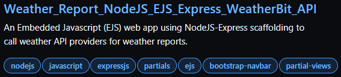
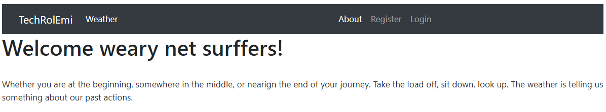

# Core Logic

To obtain the pinpoint weather data non-interactively, earth location(GPS) is a required parameter.  For this, the longitude and latitude would suffice programmatically.  For the interactive option, input of a physical postal address (partial address of City, State, or Country) is required.  Optionally, you could also register with the google map service (*additional charge will incur*).  Then, a touch or click event on the google map will yield the latitide and longitude among other values.

* The geolocation of a known address can be obtained by using the client-side javascript [Windows Navigator](https://www.w3schools.com/jsref/obj_navigator.asp).  Your browser uses different types and sources of information to identify your location. These include your IP address, geolocation via HTML5 in your browser, and your PC's language and time settings.  For more detail on how Navigator.geolocation is determined, [read more here](https://developer.mozilla.org/en-US/docs/Web/API/Geolocation/getCurrentPosition).

Sample code for client-side geolocation:

```c
    <p id="geo-coord"></p>

    <script type=javascript>
        if (navigator.geolocation) {
            navigator.geolocation.getCurrentPosition(showPosition);
        } else {
            document.getElementById("geo-coord").innerHTML =
            "Geolocation is not supported by this browser.";
        }

        function showPosition(position) {
            document.getElementById("geo-coord").innerHTML =
            "Latitude: " + position.coords.latitude +
            "Longitude: " + position.coords.longitude;
        }
    </script>
```

<br />

## Getting Real Data from A Paid API Provider

In this project (file: public/scripts.js), you can use the API service from the [weatherbit.io](https://api.weatherbit.io/v2.0/).  The good news is no credit card is required (at the time I develop this app).  You registered to use the free tier, and there is no charge as long as you stay within the allowed call limit of 1500 calls/day.  You will get errorCode 429 when you'd reached the daily limit, in which case, wait until the next daily cycle begins. Read [here](https://www.weatherbit.io/faq) to learn ways to make weather API calls.

* A typical API query for weather data can be described as follow.

    > `https://api.weatherbit.io/v2.0/history/airquality?city=${LOCATION}&start_date=${START_DATE}&end_date=${END_DATE}&tz=local&key=${API_ACCESS_KEY}`

    Where,

    **LOCATION** can be City, State.

    **START_DATE, END_DATE** in 'YYYY-MM-DD' format and evaluate to datetime range.

    **API_ACCESS_KEY** can be obtained from registering with an API provider.

* Parse the return JSON object from the API call into a GUI grid for presentation.

<br />

## Steps to Integrate A New API Provider

1. Register with a weather reporting service.  Consult with their API documentation on how to call their APIs.
2. Obtain the API access key from the same provider above.
3. Build an API https query and manually test it out.
4. Write an async function to incorporate the API call and retrieve the weather data.

> On the server, the `API_KEY` is hidden in the `.env` file when `NODE_ENV=development`.  By design, environment variables are not accessible to the client. For the client to directly query weather data, the API_KEY has to be available on the browser.  This will break the security of our application!  However, technology has solved this problem in way, way, way back.

**Options**:

* Make the API calls on the server-side and then send response containing the weather data to the client;
* or, require the client to use their own API keys;
* or, using the serverless option with locked down to a service.  *This bad option multiplies your cost as your user base grows*.

**Decision:**  

You would want to live free and die harder, let's make the client calls the server which in turn requests weather data and sends responses back.  The client then can parse the response into a grid for display.  This means the server will need to provide GET and POST routings!

---

**Options**:

You will need to implement a middleware to retrieve weather data and serve it to the client using either

* `EJS` embedded javascript templates
* or `ReactJS`.

Obviously, many developers have accountered this issue.  Lucky for us, `EJS`, `ReactJS` typically solves this problem.  EJS is an easier choice having less of a learning curve.

**Decision:**  
Let's introduce the Embedded Javascript ([EJS](https://www.npmjs.com/package/ejs)) middleware template rendering weather data upon client requests.

## Steps to Implement EJS In the Project

<strong>Partial files to be injected to other ejs files.</strong>

1. Create sub-directory `partials` under `views`.

Partial files are pieces of reusable code segment that typically appear again and again throughout your project.

The project tree structure will look as follow:

```c
    + public
        + css
            - style.css
    + views
        + partials
            - head.ejs
            - header.ejs
            - footer.ejs
        - about.ejs
        - index.ejs
        README.md
    - Dockerfile
    - index.js
    - package-lock.json
    - package.json
    - README.md
```

2. Create partial file `head.ejs`

```c
    <meta charset="UTF-8">
    <title>Staging Weather Report with EJS Template</title>

    <!-- CSS (load bootstrap from a CDN) -->
    <link rel="stylesheet" href="https://cdnjs.cloudflare.com/ajax/libs/twitter-bootstrap/4.5.2/css/bootstrap.min.css">
    <style>
    body { padding-top:20px; }
```

3. Create partial file `header.ejs` for responsive navbar display.

```c
    <!-- This code contains navigation for an HTML document and uses several classes from Bootstrap for styling. -->

    <nav class="navbar navbar-expand-md navbar-dark bg-dark">
    <button class="navbar-toggler" type="button" data-toggle="collapse" data-target="#navbarToggler"
        aria-controls="navbarToggler" aria-expanded="false" aria-label="Toggle navigation">
        <span class="navbar-toggler-icon"></span>
    </button>
    <a class="navbar-brand" href="/">TechRolEmi</a>
    <div class="collapse navbar-collapse" id="navbarToggler">
        <ul class="navbar-nav mr-auto mt-2 mt-lg-0">
        <li class="nav-item active">
            <a class="nav-link" href="/weatherbit">Weather <span class="sr-only">(current)</span></a>
        </li>
        <li class="nav-item active">
            <a class="nav-link" href="/about">About</a>
        </li>

        <li class="nav-item">
            <a class="nav-link" href="#">Register</a>
        </li>
        <li class="nav-item">
            <a class="nav-link" href="#">Login</a>
        </li>

        </ul>
        <form class="form-inline my-2 my-lg-0">
        <input class="form-control mr-sm-2" type="search" placeholder="Search" aria-label="Search">
        <button class="btn btn-outline-success my-2 my-sm-0" type="submit">Search</button>
        </form>
    </div>
    </nav>
```

4. Create a partial file `footer.ejs`

```c
    <!-- This code contains copyright information and uses several classes from Bootstrap for styling. -->
    <p class="text-center text-muted" style="
        position:fixed;
        bottom:0;
        left:20px;
    ">&copy; Copyright 2022 by The Awesome TechRolEmi</p>
```

5. Create an ejs template file `about.ejs`
    The template file will be injected with partial files created above.  This accomplishes two things: reuse partial code, and make sure the presentation is consistent between ejs templates under the `views` folder.

```c
    <!DOCTYPE html>
    <html lang="en">

    <head>
        <%- include('./partials/head'); %>
    </head>

    <body  class="container">

        <header>
            <%- include('./partials/header2'); %>
        </header>

        <main>
        <!-- design your main page here -->
        </main>

        <footer>
            <%- include('./partials/footer'); %>
        </footer>

    </body>

    </html>
```

6. Create ejs file `utils.ejs` containing client-side functions.  Notice the ejs tags <% ... %>

```c
    <%

    // Convert Unix_TimeStamp to Local DateTime.
    unixTsToLocalTime = (unix_ts) => {
        // Create a new JavaScript Date object based on the timestamp
        // multiplied by 1000 so that the argument is in milliseconds, not seconds.
        var date = new Date(unix_ts * 1000);
        // Hours part from the timestamp
        var hours = date.getHours();
        // Minutes part from the timestamp
        var minutes = "0" + date.getMinutes();
        // Seconds part from the timestamp
        var seconds = "0" + date.getSeconds();

        // Will display time in 10:30:23 format
        return hours + ':' + minutes.substr(-2) + ':' + seconds.substr(-2);
    }

    // Return verbish based on temperature trending.
    trendingTemperature = (dataArr) => {
        var sum = 0;
        for (var item of dataArr) {
            sum += item.temp;
        }
        let average = sum / dataArr.length;
        let diff = average - dataArr[0].temp;
        if ( diff > 0 ) {
            if (diff <= 3){ return "Slight warming trend ahead."; }
            else if (diff > 3 && diff <= 10) { return "Moderate warming trend ahead."; }
            else { return "Considerable warming trend ahead."; }
        } else {
            if (diff >= -3){ return "Slight cooling trend ahead."; }
            else if (diff < -3 && diff <= -10) { return "Moderate cooling trend ahead."; }
            else { return "Considerable warming trend ahead."; }
        }
    }
    %>
```

7. Create ejs template file `index.ejs`, and inject partial files as follow.

```c
    <!DOCTYPE html>
    <html lang="en">

    <head>
        <%- include('./partials/head'); %>
        <%- include('./pages/utils'); %>
    </head>

    <body  class="container">
    <header>
        <%- include('./partials/header2'); %>
    </header>

    <main>
        <!-- fill in with embedded javascript logic here -->
    </main>

    <footer>
        <%- include('./partials/footer'); %>
    </footer>
    </body>
    </html>
```

<br />

<strong>Implement server-side routings </strong>

1. Add routing for the `about` page

```c
    // about page
    app.get('/about', function(req, res) {
        res.render('about');
    });
```

2. Add routing for GET

```c
    // get the user input from the client-side via the ejs form
    app.get('/', (req, res) => {
        res.render('index');
    })

```

3. Add routing for POST

```c
    // post weather data to the client-side
    app.post('/', (req, res) => { ... })
```

<br />

<strong><span style="color:gray; font-size:18px"> Staying within the Free Tier Limit</span> </strong>

A typical free daily allowance cycle consists of up to 1000 free API calls.  In this case, the user has to wait until the beginning of the next free tier cycle.  To avoid being charged, this source code has a *a server-side accounting logic* to pause querying the weathercrossing API once its periodic allowance has been reached.  Unpause is automatic once the clock rolls to the beginning of a new daily free tier cycle.

What happens when I exceed a rate limit?
When you exceed a daily limit (calls per day) the API will return an HTTP 429 error until the rate limit resets at 00 UTC. When you exceed a per second limit (calls per second) the requests in excess of this limit will receive an HTTP 429 error from the API.

>*The server admin should monitor for demands and if there are ways to monetize it.*

<strong><span style="color:gray; font-size:18px">Caching the Weather Data</span></strong>

Weather forecast data from `weatherbit.io` typically contains information spanning 15 days, each day contains 24 hourly objects.  Additional queries within the same period would usually result in the same data.  We need to cache this information so as not to incur needless and sometimes costly API calls.  

We could elect to use the DOM Storage API, also called the [Web Storage API](https://developer.mozilla.org/en-US/docs/Web/API/Web_Storage_API/Using_the_Web_Storage_API) methods: `Window.sessionStorage` where data persists as long as the session is running, or `Window.localStorage` which has no expiration.  Note: when the last private tab is closed, data stored in the localStorage object of a site opened in a private tab or incognito mode is cleared.

<br />

<span style="color:green">**IMPORTANT:**</span>  Web Storage API needs to be implemented on the browser side (client with the DOM).  In this case, we make sure to place the javascript script at the bottom of the HTML body section.

>Another option is to use no-sql storage such as `redis`.  A topic not in the scope of this exercise.  

A sample of Web Storage API test:

```c
/* client-side script */
    <script type=javascript>
        function storageAvailable(type) {
            let storage;
            try {
                storage = window[type];
                const x = '__storage_test__';
                storage.setItem(x, x);
                storage.removeItem(x);
                return true;
            }
            catch (e) {
                return e instanceof DOMException && (
                    // everything except Firefox
                    e.code === 22 ||
                    // Firefox
                    e.code === 1014 ||
                    // test name field too, because code might not be present
                    // everything except Firefox
                    e.name === 'QuotaExceededError' ||
                    // Firefox
                    e.name === 'NS_ERROR_DOM_QUOTA_REACHED') &&
                    // acknowledge QuotaExceededError only if there's something already stored
                    (storage && storage.length !== 0);
            }
        }

        if (storageAvailable(methodString)) {
            // Yippee! We can use localStorage awesomeness
            // Save data to sessionStorage
            sessionStorage.setItem("lw_name", "marcus");

            // Get saved data from sessionStorage
            let data = sessionStorage.getItem("lw_name");

            alert(methodString +' says my name is ' + data);
            // Remove saved data from sessionStorage
            sessionStorage.removeItem("lw_name");
        }
        else {
            // Too bad, no localStorage for us
            alert(methodString + ' says Web Storage API is disabled.')
        }
    </script>
```

## Et, Voila`



## Next Phases

The followings are potential developments in subsequent iterations of this weather report project:

* Integrate the server with auth0 and/or passport authentication

* Registered members have access to a full-blown dashboard with maritime alerts, historical weather data, extended forecasts, etc.

* Switch to `write once run anywhere` mode.  Build and make mobile apps available to subscribed members.

* Collect user geolocation information for sale pitch to advertizers.

* Look into how you can monetize this sucker.  [Read more](https://www.smaato.com/blog/how-to-best-monetize-your-weather-app/).
